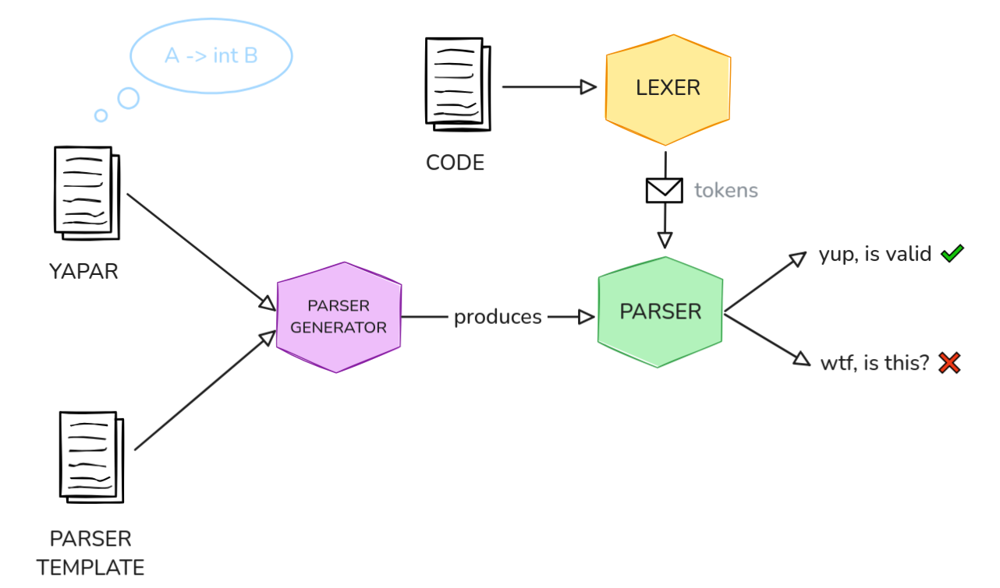
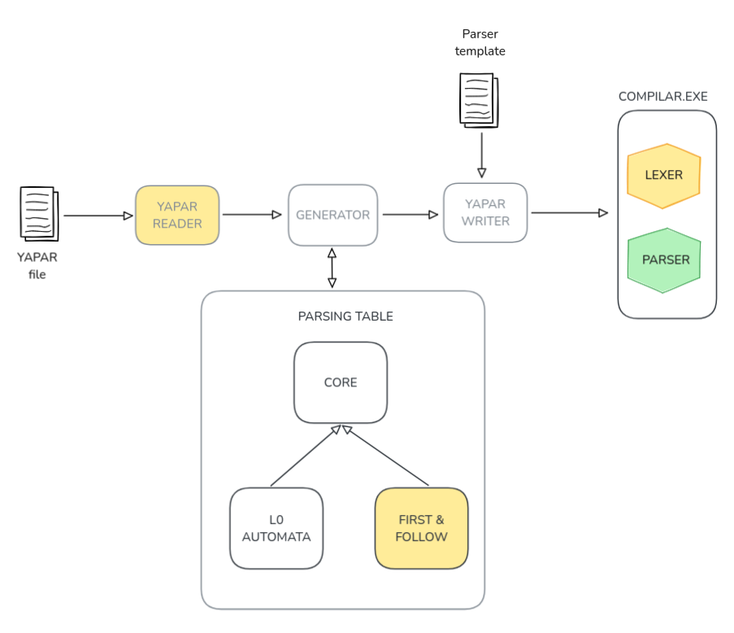

<h1 align="center">Parser and Lexer🚀</h1>
<h3 align="center">(A simple parser and lexer)</h3>

Hi! This project aims to be an educational implementation of a **Lexer Generator & Parser generator** following a Lex-like and Yapar-like sintax to configure it. 

It uses a **Deterministic Finite Automata(DFA)** for Regex Patterns recognition, and a **L0 Automata** for syntax recognition. Down below, there will be more explanation about the actual pipeline the inputs suffer in order to recognize tokens.

## Getting Started 🎬

```bash
task buildParser    // Builds the parser generator
task test           // Run tests
task clean          // Removes executables
```

```bash
./bin/parser -f ./examples/productions3.y -o ./ora
# example:
./bin/parser -f ./examples/productions3.y -o ./ora
```

## The General Pipeline
A parser is a piece of software that identifies the structure of an input and tells you:

> "Dude, this code you gave me doesn't follow the syntax of your language :p"

When constructing a language, the parser is in charge of the **syntactic analysis of the code.** Acting like a guard, it stops invalid code from advancing to the next steps, saving time and computational resources.

Like lexers, parsers can share many components, making it easy to standardize them and build a Parser Generator. **This is exactly what our Yapar does!** The general flow consists of:

1. Providing a Yapar definition that specifies all the syntactic rules input code must follow to be considered valid.

2. A template that contains the common pieces all parsers share (check ours at `/template`).

3. The generator takes those rules and builds a functional `parser.go` file.

4. Providing a `lexer.go` (this one can also be generated) that reads the input code and pass it to the `parser.go` as a stream of tokens.




## Parser Architecture




What is the parser doing?

1. Reads a Yapar file to recognize which tokens and productions can it recognize to either accept or not. 

2.  Those tokens and productions will pass them to the generator in order to create a table to check if the input we will give is either correct or not.  

    2.1 First step is to create a L0 automata which guides us from one node to another node based on the tokens production to find the finals nodes which will be used to parse. 

    2.2 We also compute the first and follow in order to generate a table to reduce or go to so se if it can be accepted or not. 

3. Now we introduce all componentes from the generator to a Parser template for GO in order to compile it and get a file to run it. 

